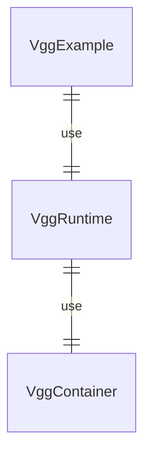

# vgg_ios
An iOS runtime library for [VGG](https://vgg.cool/) that supports both UIKit and SwiftUI.

## Overview

|Item|Description|
|-|-|
|VggExample|The application using VggRuntime|
|VggRuntime| Vgg iOS Framework|
|VggContainer| Vgg c++ library |


## Getting Started

1. [Build](https://github.com/verygoodgraphics/vgg_runtime?tab=readme-ov-file#ios-building-example) VggContainer.
2. Build VggRuntime.Framework.
Open the Vgg.xcworkspace in XCode and select the VggRuntime scheme.

## Usage
### SwiftUI
1. Importing VggRuntime. Add the following to the top of your file where you utilize the VggRuntime.
```
import VggRuntime
```

2. Setup VggViewModel and use VggView.
```
struct VggCounter: View {
    var body: some View {
        if let filePath = Bundle.main.path(forResource: "counter",
                                           ofType: "daruma",
                                           inDirectory: "Assets") {
            let vggViewModel = VggViewModel(filePath: filePath)
            return vggViewModel.view()
        } else {
            return Text("Please provide a vgg file")
        }
    }
}
```
### UIKit
```
class CounterViewController: UIViewController {
    var vggView: VggView {
        let filePath = Bundle.main.path(forResource: "counter",
                                        ofType: "daruma",
                                        inDirectory: "Assets")! 
        let vggViewModel = VggViewModel(filePath: filePath)
        return vggViewModel.createVggView()
    }
    
    override func viewWillAppear(_ animated: Bool) {
        view.addSubview(vggView)
        vggView.frame = view.bounds
    }
}
```

## Example
You can run our iOS example app in this repository, open the Vgg.xcworkspace in XCode and select the VggExample scheme.